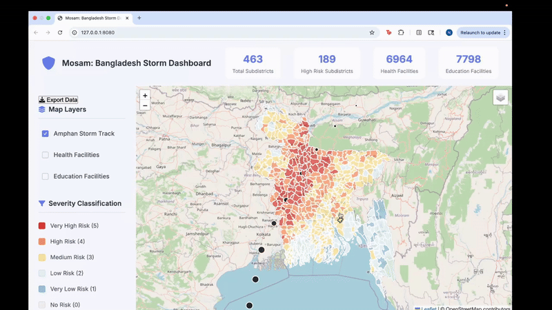

# Mosam: Monitoring and Observation for Storm Assessment and Mobilization (Bangladesh)

A comprehensive web-based dashboard for assessing storm risk to children under five in Bangladesh at the sub-district level.

 

## Features

- **Interactive Map**: Sub-district level visualization of Bangladesh with storm risk classification
- **Risk Assessment**: 5-level storm risk scoring based on Cyclone Amphan track and wind intensity
- **Facility Mapping**: 6,964 health facilities and 7,798 education facilities plotted
- **Layer Controls**: Toggle visibility of storm track, health facilities, and education facilities
- **District Information**: Detailed popup information for each sub-district

## Installation

1. **Extract the files**:
   ```bash
   unzip bangladesh_storm_dashboard.zip
   cd bangladesh_storm_dashboard
   ```

2. **Create virtual environment**:
   ```bash
   python3 -m venv venv
   source venv/bin/activate  # On Windows: venv\Scripts\activate
   ```

3. **Install dependencies**:
   ```bash
   pip install -r requirements.txt
   ```

## Running the Application

1. **Start the Flask server**:
   ```bash
   python app.py
   ```

2. **Access the dashboard**:
   Open your browser and navigate to `http://localhost:5000`

## File Structure

```
bangladesh_storm_dashboard/
├── app.py                          # Main Flask application
├── requirements.txt                # Python dependencies
├── processed_geodata.pkl           # Processed geospatial data
├── bangladesh_classified.geojson   # Classified district data
├── process_geojson.py             # Data processing script
├── analyze_data.py                # Risk analysis algorithms
├── templates/
│   └── index.html                 # Main dashboard template
└── static/
    ├── css/
    │   └── style.css              # Dashboard styling
    └── js/
        └── dashboard.js           # Interactive map functionality
```

## Data Sources

- **Administrative Boundaries**: Bangladesh sub-district polygons
- **Storm Track**: Cyclone Amphan 2020 track data with wind speeds
- **Health Facilities**: OpenStreetMap health facility points
- **Education Facilities**: OpenStreetMap education facility points
- **Population Data**: Population density of children under five

## Risk Classification

### Storm Risk Levels:
- **Level 5 (Very High)**: Red zones
- **Level 4 (High)**: Orange zones  
- **Level 3 (Medium)**: Yellow zones
- **Level 2 (Low)**: Light blue zones
- **Level 1 (Very Low)**: White zones
- **Level 0 (No Risk)**: Areas outside storm impact - Gray zones

## Technical Details

- **Backend**: Flask (Python)
- **Frontend**: HTML5, CSS3, JavaScript
- **Mapping**: Leaflet.js with OpenStreetMap tiles
- **Data Processing**: GeoPandas, Shapely
- **Spatial Analysis**: 50km buffer zones around storm track
- **Coordinate System**: WGS84 (EPSG:4326)

## Browser Compatibility

- Chrome 80+
- Firefox 75+
- Safari 13+
- Edge 80+

## License

This project uses open data sources and is intended for disaster preparedness and emergency planning purposes.

